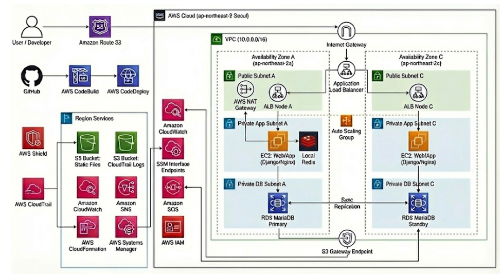

> 구조적이고 지속 가능한 인프라를 설계하는 엔지니어  
> 단기적 결과보다 “오래 유지될 수 있는 시스템”을 지향합니다.

---

## 📌 Table of Contents

1. [About Me](#-about-me)
2. [Project Overview](#-project-overview)
3. [Architecture & Environment](#-architecture--environment)
4. [Trouble Shooting & Engineering Decisions](#-trouble-shooting--engineering-decisions)
5. [Improvements](#-improvements)
6. [What I Learned](#-what-i-learned)
7. [Links](#-links)

---

## 🧑‍💻 About Me

> 👋 지속 가능한 인프라를 설계하는 **엔지니어 곽경국**입니다.

### 🛠 Technical Skills

**Infra / Network**  
TCP/IP · DNS · ACL · VPN · Routing  

**Server / DB**  
Linux(Ubuntu) · Nginx · Apache · MySQL · Oracle

**VM / Cloud**  
VM ware · AWS (EC2 · RDS · IAM · ASG · WAF · CodeDeploy)  

**Container & Orchestration**  
Docker · Kubernetes · Minikube  

**DevOps / Automation**  
Git · GitHub Actions · Terraform · CloudFormation  

**Application**  
Java · Spring Boot · Python · Django · PHP · REST API 

**Monitoring**  
Prometheus · Grafana

<!-- 
이 영역에는 개인의 배경, 경력 요약, 기술적 정체성,
DevOps/Infra를 선택하게 된 이유 등을 작성 예정
-->

---

## 🔖 Project Overview

### 🖍️ AWS 기반 교육형 웹 서비스 프로젝트

**목표**  
웹 기능 개발이 아닌, AWS 인프라 아키텍처 설계·구축·보안·CI/CD·운영 자동화 역량 검증

본 프로젝트는 애플리케이션 기능 구현보다  
인프라 설계, IaC 기반 환경 구성, 배포 자동화,  
보안 설정 및 운영 이슈 대응까지  
서비스의 전 라이프사이클을 직접 설계·검증하는 것을 목표로 진행되었습니다.

**Project Info**
- 프로젝트 기간 : 2025.12.17 ~ 2026.01.16 (총 31일)
- 참여 인원 : 4명

**Role**  
- 팀장
- 회의 진행
- 요구사항 정의서 / ERD / 아키텍처 다이어그램 / WireFrame / WBS 작성
- AI 기반 Django 애플리케이션 개발
- CI/CD 구축

---

## 👉 Architecture & Environment

### Cloud Environment
- AWS Multi-AZ Architecture
- Auto Scaling Group
- ALB
- WAF
- IAM Role 기반 접근 제어

### Server
- Ubuntu (EC2)
- MariaDB (RDS)
- Redis (Single EC2)

### CI/CD
- GitHub Actions
- S3
- CodeDeploy
- CloudFormation (IaC)

### Tech Stack
- Python / Django
- Redis (cache/broker)
- Celery / Celery Beat

---

## 🧠 Trouble Shooting & Engineering Decisions

### 1️⃣ Packer 기반 AMI 배포 시간 과다 문제

**BEFORE**
- GitHub Actions → Packer AMI Build
- ASG Rolling Update 방식 배포
- 평균 20분 이상 소요

**문제**
- AMI 단위 배포는 속도 및 운영 유연성이 낮음

**AFTER**
- Packer는 OS 표준화 용도로만 사용
- 앱은 GitHub Actions에서 빌드
- S3 업로드 → CodeDeploy 배포

**RESULT**
- 배포 시간 20분 → 5분 이내 단축
- 인프라 표준화와 애플리케이션 배포를 분리하는 구조 확립

---

### 2️⃣ t3.micro CPU Throttling Issue

**BEFORE**
- Free Tier 환경에서 `t3.micro` 인스턴스 사용
- CPU 사용률 99% 도달 후 10%로 급격히 제한 반복
- ASG Health Check 실패로 인스턴스 재생성 발생

**문제**
- `t3.micro`의 Baseline CPU 10% 제한 구조
- SSM / CloudWatch / CodeDeploy Agent 등의 상시 부하 존재
- 실제 워크로드 대비 리소스 설계 부족

**AFTER**
- 인스턴스 타입 상향 조정
- 불필요한 Agent 및 오버엔지니어링 요소 제거
- 워크로드 기반 리소스 산정 기준 수립

**RESULT**
- CPU Throttling 현상 제거
- ASG 불필요 재생성 문제 해결
- 비용 최적화는 단순 저사양이 아닌 **안정성 기반 설계**라는 관점 확립

---

### 3️⃣ WAF Ruleset Causing `/admin` 403 Error

**BEFORE**
- ALB 및 Target Group 정상 동작
- Routing 및 Health Check 이상 없음
- `/admin` 경로 접근 시 403 오류 발생

**문제**
- WAF `AWSManagedRulesAdminProtectionRuleSet` 적용으로 `/admin` 자동 차단
- 애플리케이션 레벨이 아닌 보안 정책 레벨 이슈

**AFTER**
- WAF ACL Ruleset 분석
- 해당 경로 예외 처리 적용
- 인프라 보안 정책 포함 검증 절차 수립

**RESULT**
- `/admin` 정상 접근 복구
- 배포 성공 ≠ 서비스 정상이라는 인식 확립
- 보안 설정까지 포함한 **Blue/Green 배포 검증 필요성 도출**

---

## 📈 Improvements

- Redis EC2 → ElastiCache 전환 (SPOF 제거)
- Blue/Green 배포 전략 설계
- IAM Role 기반 임시 권한 구조 적용
- IaC 기반 협업 프로세스 확립

---

## 📚 What I Learned

- AWS 인프라 전체 라이프사이클 경험
- IaC + CI/CD 자동화 설계 경험
- 인프라 레벨 장애가 서비스에 미치는 영향 체감
- AI를 활용하되, 의사결정은 사람이 책임져야 한다는 점

> AI는 도구이고,  
> 설계와 판단의 책임은 엔지니어에게 있습니다.

---

## 🔗 Links

- 
- 
 

